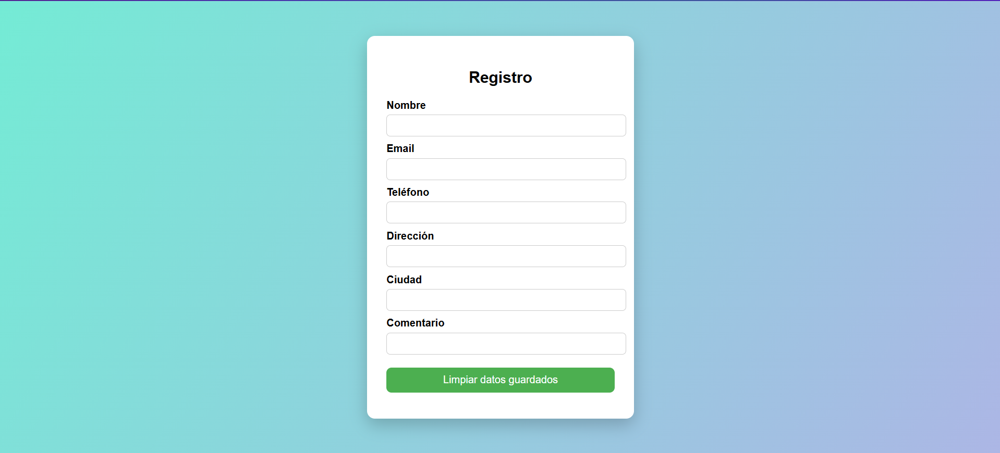
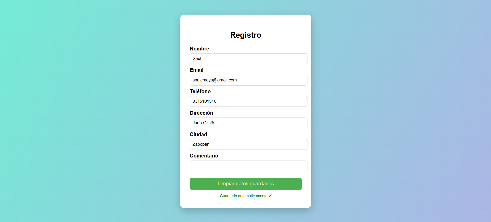

# Formulario Web con Auto-Guardado

Formulario sencillo que guarda automáticamente los datos introducidos por el usuario en el navegador (localStorage) y permite restaurarlos después de recargar o cerrar la página.

---

## Características
- Guardado automático en tiempo real (evento `input`)
- Restauración de datos al recargar la página
- Interfaz centrada y estilizada con CSS
- Botón para limpiar los datos guardados
- Sin instalación: funciona en cualquier navegador moderno

---

## Capturas
  


---

## Tecnologías
- HTML5
- CSS3
- JavaScript (localStorage)

---

## Cómo ejecutar
1. Clonar el repositorio:
   ```
   git clone URL_DEL_REPO
   ```
2. Abrir el archivo `formulario.html` en el navegador.
3. No se requiere servidor ni instalación adicional.

---

## Uso
- Introducir datos en los campos del formulario: se guardan automáticamente.
- Recargar la página o cerrar el navegador y volver: los datos se restaurarán.
- Usar el botón "Limpiar" del formulario para borrar los datos guardados en localStorage.

---

## Estructura del proyecto
- `formulario.html` — página principal con el formulario y el script de auto-guardado.
- `styles.css` — estilos de presentación (si aplica).
- `README.md` — documentación.

---

## Cómo funciona (breve)
El script escucha eventos `input` en los campos y guarda los valores en `localStorage` con claves asociadas a cada campo. Al cargar la página, el script lee `localStorage` y restaura los valores en los campos correspondientes.

---

## Compatibilidad y notas
- Funciona en navegadores modernos con soporte para `localStorage`.
- No es seguro para almacenar información sensible (contraseñas, datos personales críticos).

---

## Licencia
Licencia MIT — libre para usar y adaptar.